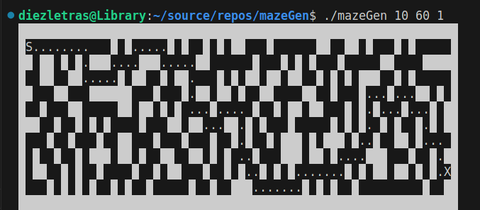

# maze generator

- Starting to learn golang.
- Uses [Iterative randomized Prim's algorithm](https://en.wikipedia.org/wiki/Maze_generation_algorithm) and iterative randomized DFS
- Uses [A* algorithm](https://www.redblobgames.com/pathfinding/a-star/introduction.html) to find solutions
- Built using go1.24.6 linux/amd64

## Build

```bash
go build -o mazeGen *.go
```

## Usage

```
Usage:
./mazeGen [height] [width] [algorithm] [dificulty] [-s]

algorithms:
1: Prim's (default)
2: DFS

dificulty: the higher the number the easier the puzzle. default = 0 (hardest)

-s: Show Solution (optional)
```

## ScreenShots

