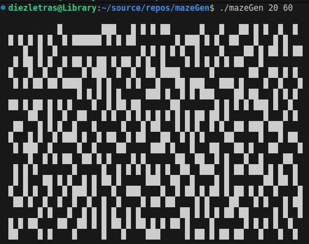

# maze generator

- Starting to learn golang.
- Uses [Iterative randomized Prim's algorithm](https://en.wikipedia.org/wiki/Maze_generation_algorithm)
- Built using go1.24.6 linux/amd64

## Build

```bash
go build mazeGen.go common.go generate.go
```

## Usage

```bash
./mazeGen [height] [width]
```

## ScreenShots

